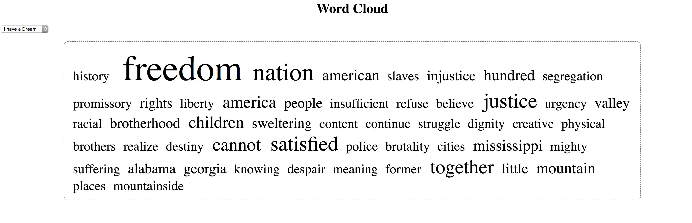

# Assignment 4
** Due March 28th before class. **

## Task

Start with
[this
code](https://github.com/tejaswigowda/ame2202018/tree/master/wordCloud)
and make sure yoiu generate appropriate wordclouds.

## Example

## Submission
Demo in class.

## Execution
0. Install node.js (nodejs.org).
1. ``cd path-to/ame2202018/wordCloud ``
2. `` node server.js ``
3. Go to `http://localhost:1234` (in browser);
